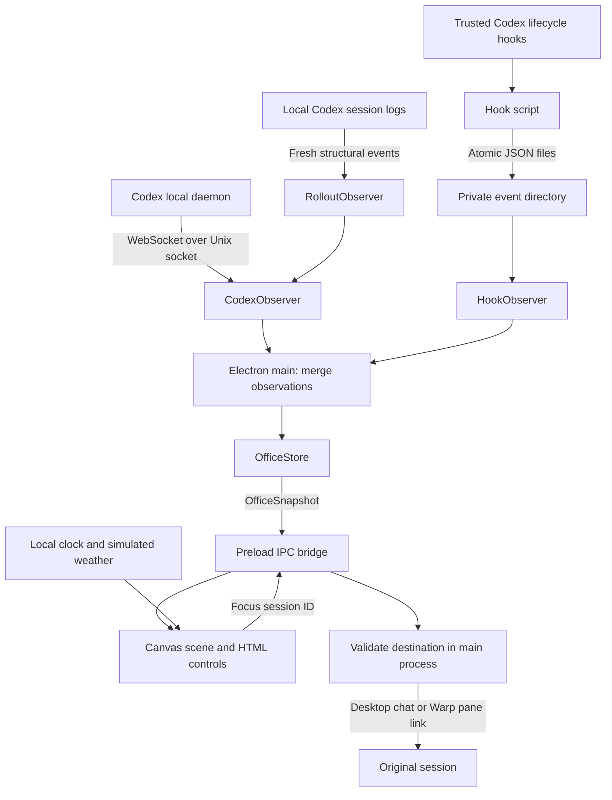

# Cyber Co-workers architecture

Cyber Co-workers is a local Mac desktop application that represents Codex desktop and CLI sessions as characters in an animated office. Each top-level session owns a character and desk. Session monitoring supplies factual activity; the renderer uses that activity to choose poses and movement while independently animating the room.

This document describes the current implementation. Setup commands are in [README.md](README.md); hook installation and trust are explained in [README-hooks.md](README-hooks.md).

## System overview



There is no hosted backend. Observation, normalization, and desktop navigation run in Electron's main process. Drawing and interaction run in the renderer process. A narrow preload bridge connects them.

## Modules and ownership

The source tree has five responsibility areas. `app` wires the Electron runtime,
`integrations` observes external providers, `office` owns session behavior,
`renderer` owns presentation, and `shared` defines their common contracts.

Dependency direction:

- `app` composes `integrations`, `office`, and `shared`.
- `integrations` normalizes external observations into `shared` contracts.
- `office` depends on `shared`; it does not import Electron, filesystem observers,
  or provider transports.
- `renderer` uses `shared` types and the preload interface; it does not import
  `app`, `office`, or `integrations`.
- `shared` is runtime-neutral and imports no other source area.

For a new provider, place observation and normalization in `integrations/<provider>/`,
produce `WorkerSession` observations (or validated hook events), and wire the observer
in `app/index.ts`. Extend the shared provider types and renderer labels when needed.
Provider transport details stay inside the integration. Shared office policies, such
as desk allocation or dismissal, belong in `office`.

Keep tests beside the module they exercise. Cross-module recovery and subprocess
checks live in `tests/integration/`. `scripts/test.mjs` discovers all nested
`*.test.ts` and `*.test.mjs` files under `src`, `scripts`, and `tests`.
Development tooling lives in `scripts/dev/`. The top-level hook executables in
`scripts/` retain their paths because existing user hook configurations reference
those absolute paths. Build output remains `dist/main` and `dist/renderer`.


| Module | Responsibility |
| --- | --- |
| `src/app/index.ts` | Application lifecycle, window creation, IPC handlers, observation merging, live/demo selection |
| `src/integrations/codex/observer.ts` | Connect to the existing Codex daemon, poll loaded sessions, reconnect, merge daemon and log observations |
| `src/integrations/codex/codex-state.ts` | Normalize daemon metadata into the shared session model |
| `src/integrations/codex/codex-rollouts.ts` | Read fresh structural events from local session logs when direct live metadata is unavailable |
| `src/integrations/hooks/observer.ts` | Consume minimal hook events from a private directory |
| `src/shared/hook-event.ts` | Define and validate the runtime-neutral hook event contract |
| `src/office/hook-sessions.ts` | Merge hook events with observed sessions |
| `src/office/session-routing.ts` | Recover and retain valid navigation destinations |
| `src/office/demo.ts` | Supply simulated office sessions |
| `src/office/store.ts` | Retain sessions, allocate stable desks, preserve navigation links, and honor dismissals |
| `src/office/navigation.ts` | Select and validate an exact-session destination |
| `src/app/preload.ts` | Expose the limited `window.office` API to the renderer |
| `src/shared/types.ts` | Define the session, snapshot, and IPC API contracts |
| `src/renderer/main.ts` | Canvas artwork, character animation, scene hit testing, roster, overflow, and tooltips |
| `src/renderer/style.css` | Window layout, responsive sizing, controls, and status styling |
| `scripts/codex-hook.mjs` | Convert hook input into a bounded status event without retaining prompts or tool commands |
| `scripts/install-hooks.mjs` | Merge hook definitions into Codex configuration, backing up an existing configuration |

## Observation sources

### Codex daemon

`CodexObserver` connects to the existing control socket using the `ws` library. The default socket is under `~/.codex/app-server-control/`; `CODEX_HOME` and `CYBER_CODEX_SOCKET` can override the relevant locations.

The observer initializes a metadata client and polls `thread/loaded/list`, followed by `thread/read` with `includeTurns: false`, every two seconds. It enumerates loaded sessions rather than historical conversations. It does not start or resume threads, submit prompts, answer approvals, or respond to unsolicited server requests.

Daemon metadata supplies available thread names, working directories, and runtime status. Parent/subagent metadata excludes subagents from the desk roster. Lost connections mark observed daemon sessions disconnected and trigger reconnection after five seconds.

### Fresh local session events

Some desktop sessions use a separate private app-server, so they are not visible through the shared CLI daemon. `RolloutObserver` provides a best-effort fallback by reading session files under the Codex home directory.

Admission requires fresh structural activity timestamped after the observer started. Old conversations do not appear merely because their files exist. The reader uses session metadata to identify the session and its origin, filters out subagents, and recognizes explicit work, completion, interruption, and input-request markers. Matching call IDs keep unrelated tool outputs from clearing an outstanding input request.

Reading is bounded: the initial activity tail is at most 256 KiB, and subsequent reads are at most 1 MiB per file per poll. Prompts and outputs may be present in the bytes read, but their contents are not stored in the application model or sent to the renderer. Fallback labels use the project name and a short session ID.

A working session with no new structural signal retains its last reported state. Silence does not imply completion. This fallback depends on internal log formats and cannot guarantee detection of every approval or input state.

### Lifecycle hooks

Trusted Codex hooks invoke `scripts/codex-hook.mjs`. The script normalizes stdin JSON and writes one atomically replaced event file per session to:

```text
~/.local/share/cyber-co-workers/events/
```

`CYBER_CO_WORKERS_EVENT_DIR` can override that directory. The directory is private, files are created with owner-only permissions, and filenames are hashes of session IDs.

Events contain a session ID, status, timestamp, project basename, and optional validated Warp focus URL. Permission events can include a sanitized approval description capped at 240 characters. Full prompts, tool commands, and tool argument objects are discarded. The script has an input cap and deadline and does not return an approval decision.

`HookObserver` checks for changes every 700 milliseconds, validates file ownership and shape, and rejects oversized, stale, or excessively future-dated events. Hook installation preserves existing configuration. Trust remains a separate action in Codex; the installer does not grant it.

## Shared state and merging

`WorkerSession` contains:

- Identity: `id`, `title`, `project`, and `source` (`desktop`, `cli`, or `unknown`).
- Activity: `status`, optional `detail`, and `updatedAt`.
- Presentation/navigation: `desk` and optional `focusUrl`.

`OfficeSnapshot` carries the session list, overall connection indicator, explanatory message, and explicit demo flag.

| Status | Meaning | Office behavior |
| --- | --- | --- |
| `working` | An observed active state or work event | Character works at its desk |
| `idle` | An explicit idle state or completed/interrupted turn | Character remains present and can wander |
| `waiting` | An observed approval or user-input request | Character shows a question mark |
| `disconnected` | Current state cannot be established | Transport observation only; existing occupants retain their last reported state |

Observations are deduplicated by session ID. A live daemon record takes precedence over the log fallback; a disconnected daemon record does not replace an available log record. Main-process merging preserves hook-provided Warp links and CLI identity. Accepted hook state can fill a disconnected observation and keeps hook-only sessions present without an inactivity timeout. Hook callbacks publish immediately; subsequent live observations may replace their activity details.

`OfficeStore` assigns the first available desk and retains that assignment across polling order changes. Missing or disconnected observations preserve existing occupants and their last reported state. Only an explicit session-end event or manual dismissal removes an occupant; no expiry timer runs. Ended sessions can resume with a new hook event, while manual dismissal prevents readmission for the app run. Assignments and dismissals are in memory, not persisted across restarts.

## Desktop boundary and navigation

The renderer has no direct Node.js access. Electron enables sandboxing and context isolation, and the preload exposes only:

```text
getSnapshot()
onSnapshot(callback)
focusSession(id)
dismissSession(id)
setDemo(enabled)
```

The main process handles these requests and publishes `office:changed` snapshots. Clicking a character sends a session ID, not an arbitrary command or URL.

Navigation validates destinations before using Electron's `shell.openExternal`:

- Desktop sessions use `codex://threads/<thread-id>`.
- CLI sessions use the exact captured `warp://session/<32-hex-id>` or Warp Preview equivalent.
- Missing or unidentified destinations return an explanation to the UI.

A Warp pane ID is never guessed from a Codex thread ID. Whether Codex passes the originating Warp environment into a hook determines whether that pane link can be captured. Opening a URL successfully does not independently prove that the destination app selected the intended pane.

## Office rendering

The renderer draws original procedural pixel art with Canvas 2D. HTML/CSS provide the surrounding controls, accessible session buttons, tooltips, and overflow picker. Eight visible desks occupy a fixed four-by-two layout. Extra sessions remain in the snapshot and can be brought into the room through overflow selection.

Session updates and animation have separate cadences. Snapshot changes update factual state; `requestAnimationFrame` paints at approximately 30 frames per second. Animation pauses while the document is hidden. Roster buttons remain intact when displayed fields have not changed, preserving keyboard focus and accessibility targets.

The Mac's local time drives the displayed clock and day/night sky. Weather is a local selection between clear, cloudy, and rain. Neither weather nor decorative movement changes the underlying session status.

Demo mode supplies explicitly simulated workers. A browser-only preview has no Electron preload and therefore uses a labeled demo. The desktop app defaults to live monitoring. Demo characters cannot open or dismiss real sessions.

## Build and verification

Vite builds the renderer into `dist/renderer`. TypeScript checks all source files, and esbuild bundles the Electron main process and preload into `dist/main`. Electron Packager produces the Mac application under `release/`. The local package is unsigned.

`npm test` covers status normalization, historical/subagent filtering, fresh log discovery and completion, stable desks, dismissal, URL validation, and the hook subprocess-to-file-to-observer path. These tests do not make model requests. Live integration checks are still needed when Codex or Warp changes its protocol, log format, hook behavior, or URL handling.

### Routing lifetime

Warp pane links are identity metadata, separate from activity freshness. Valid persisted hook links enrich sessions already observed live, regardless of hook age; they never admit historical sessions or replay old activity. Session-end events invalidate the stored route. The one-minute freshness check applies only when reading spool events; accepted sessions do not expire. Both daemon and rollout observers recognize the `codex-tui` originator as CLI, even when the transport source is `vscode`.

Sessions with no captured Warp link remain visible but cannot navigate precisely. Sending a new prompt in that Warp session lets the trusted hook capture its pane URL. An empty loaded CLI session may appear untitled until it has task metadata; it can be dismissed from the roster.

## Claude Code adapter

`scripts/claude-hook.mjs` maps Claude Code hook inputs to the shared minimal event schema and reuses the bounded atomic writer in `scripts/codex-hook.mjs`. `scripts/print-hook-config.mjs claude` generates the configuration; `npm run connect:claude` merges it into Claude settings with a backup. The event carries `harness: "claude"` and a `claude:`-prefixed ID, keeping it separate from Codex IDs in the spool, routing map, store, and UI. Existing Codex events remain compatible and default to Codex when the harness field is absent.

`src/office/hook-sessions.ts` merges fresh hook sessions with Codex observations. Both hook callbacks and observer polls refresh the combined snapshot, so a Claude-only office reports connected even when the Codex daemon is unavailable. Session end carries an explicit ended marker and removes the occupant, allowing a resumed session to return. Manual dismissals still belong to the store. Claude navigation only accepts captured Warp destinations.

Claude is a local hook-only provider: no historical scan, transcript parsing, remote cloud monitoring, or model requests. Accepted sessions persist without an inactivity timeout and retain their last reported state. If a terminal closes without emitting SessionEnd, manual dismissal is required. Subagent hook events are filtered by `agent_id`; the adapter never stores user content or emits decisions. Tests cover the adapter lifecycle, installer preservation/idempotence, actual subprocess-to-observer delivery, namespace isolation, resumption, and retention during silence alongside the existing Codex tests.
